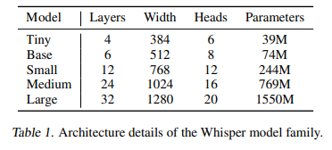

<!DOCTYPE html>
<html>

<body>
  <h1>Transcrição de áudio utilizando biblioteca OpenAi-Whisper</h1>
  
Este projeto foi utilizado com finalidade em poupar tempo na criação de arquivos de texto para locução. Utilizo para transcrever anúncios de produtos do facebook e fazer uma locução para o meu próprio anúncio. Ao invés de perder tempo escrevendo manualmente, eu executo esse script com vários arquivos de áudio de anúncios e junto as partes que eu achar relevantes.

  <h2>Pré-requisitos</h2>
  
Certifique-se de ter a biblioteca openai-whisper intalada em ambiente Python. Você pode fazer a instalação das mesmas usando o gerenciador de pacotes pip e digitando <code>!pip install openai-whisper</code>

  <h2>Execução</h2>
  <ul>
    <li>Clone este repositório para o seu computador.</li>
    <li>Abra o arquivo script.py em um IDE.</li>
    <li>Coloque o seu áudio na pasta do script e altere o código com o nome do seu áudio.</li>
  </ul>

  <h2>Um pouco mais sobre a biblioteca Whisper</h2>
  
A biblioteca whisper conta com 5 tipos de modelos, cada um com seu respectivo requisito de execução. O modelo tiny, utilizado por mim nesse projeto, conta com um nível de processamento mais rápido, porém não é tão acertivo quanto o Large, que por sua vez possui um requisito de VRAM maior. Por esse motivo, é mais difícil de ser executado em computadores mais modestos.

  
  
 <h4>É incrível o que podemos fazer com apenas 4 linhas de código, e quanto tempo podemos economizar. O tempo é o ativo mais valioso da vida, gaste-o bem!</h4>

  <h2>Contribuição</h2>
  
Contribuições são bem-vindas! Se você deseja melhorar ou expandir este projeto, fique à vontade para abrir um pull request.

  
  
</body>
</html>
